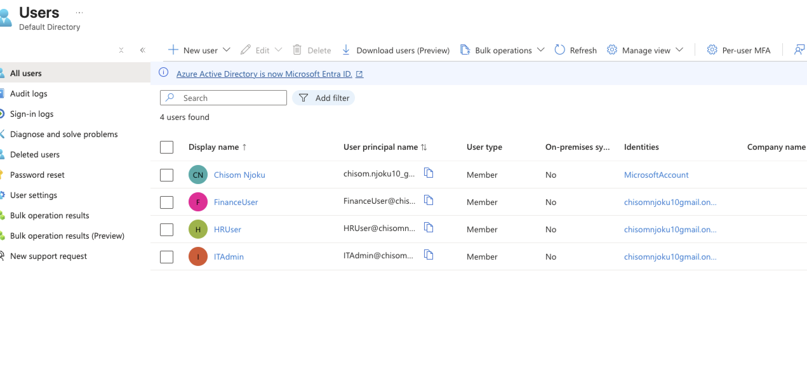

# 🧩 Azure IAM Lifecycle Project (Joiner–Mover–Leaver Simulation)

**Every control tells a story.**  
By tracking IAM KPIs (Provisioning, Access Review, Deprovisioning), I turned governance data into insight — showing how compliance can be both measurable and meaningful.  

This project simulates a **Joiner–Mover–Leaver IAM lifecycle** using **Microsoft Entra ID (Azure AD)** — all built entirely on a **free-tier Azure account**.  
It demonstrates role-based provisioning, access review, and deprovisioning with mapped compliance frameworks to NIST, ISO 27001, and SOX 404.

---

## ⚙️ Frameworks Mapped
- **ISO 27001:** A.9.2.5, A.9.2.6 (User Provisioning, Deprovisioning)  
- **NIST SP 800-53:** AC-2, AC-5 (Account Management, Separation of Duties)  
- **SOX 404:** IT General Controls for Access Reviews and User Lifecycle  

---

## 🧩 Step 1 – Create Users
Created three sample users to simulate enterprise departments:  
- `HRUser` – HR Department  
- `FinanceUser` – Finance Department  
- `ITAdmin` – IT Department  

📸 **Screenshot:**  

📝 *Represents the Joiner phase — provisioning accounts for new hires.*

---

## 🧩 Step 2 – Create Groups
Created security groups for access segmentation:  
- `HRTeam`  
- `ITTeam`  

📸 **Screenshots:**  
- HR Group →   
- IT Group → 

📝 *Implements ISO 27001 A.9.2.3 (User Access Provisioning).*

---

## 🧩 Step 3 – Add Users to Groups
- `HRUser` and `FinanceUser` added to **HRTeam**  
- `ITAdmin` added to **ITTeam**  

📸 **Screenshot:**  

📝 *Demonstrates least privilege through functional grouping.*

---

## 🧩 Step 4 – Assign Role-Based Access Control (RBAC)
`ITAdmin` granted the **User Administrator** role to manage directory users.  

📸 **Screenshot:**  

📝 *Implements NIST AC-5 and ISO 27001 A.6.1.2 (Separation of Duties).*

---

## 🧩 Step 5 – Access Review & Deprovisioning
Conducted access reviews and removed excess permissions.

#### Before Access Review  

#### During Review  

#### After Review  

#### Account Disabled  

📊 [Download Access Review Report](assets/access_review_report.xlsx)  
*Shows which users were reviewed and removed during the access review process.*

📝 *Illustrates the Leaver process and compliance with NIST AC-2(3) and ISO 27001 A.9.2.6.*

---

## 📊 Step 6 – KPI Dashboard
Created a KPI Dashboard in Excel to measure IAM performance.  

| Metric | Description | Target | Actual | Status | Comment |
|:--|:--|:--:|:--:|:--:|:--|
| Provisioning SLA | Time to create new users (Joiner) | 95% | 100% | ✅ Met | All users created same day |
| Access Review Completion | Groups reviewed within deadline | 100% | 100% | ✅ Met | FinanceUser reviewed |
| Deprovisioning SLA | Time to disable leaver | 100% | 100% | ✅ Met | HRUser disabled immediately |
| Access Revocations | % of unnecessary access removed | 100% | 100% | ✅ Met | Removed FinanceUser from ITTeam |
| Policy Compliance | Alignment with NIST / ISO / SOX | 100% | 95% | ⚠️ Partial | Manual review process |

📸 **Screenshot:**  

📁 [Download KPI Performance Report](assets/kpi_performance_report.xlsx)  
*Contains the Excel data and calculations used to build the IAM KPI Dashboard.*

📝 *Visualizing IAM governance data for compliance and audit readiness.*

---

## ✅ Step 7 – Key Learnings
- Practiced IAM lifecycle management using **Microsoft Entra ID (Free Tier)**.  
- Strengthened understanding of **RBAC, SoD, and Compliance Mapping**.  
- Measured IAM effectiveness using **quantifiable KPIs**.  

---

## 🧰 Tools Used
- Microsoft Entra ID (Azure AD)  
- Microsoft Excel  
- PowerShell (Conceptual for Automation)  

---

## 🏁 Summary
This hands-on simulation was fully completed using a **free-tier Azure account** to demonstrate how IAM controls connect to real compliance frameworks — proving that **effective identity governance can be measurable, auditable, and business-aligned**.
