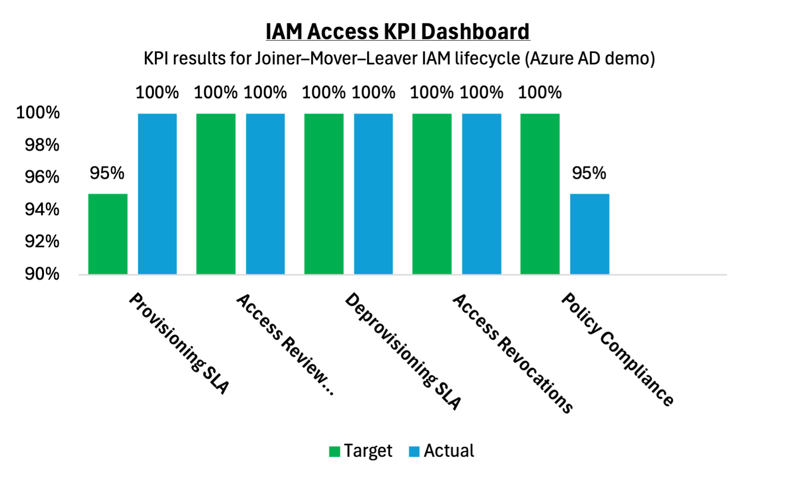

# 🧩 Azure IAM Project – KPI Dashboard

This project shows how I tracked **Identity and Access Management (IAM)** performance using measurable **Key Performance Indicators (KPIs)** across the **Joiner–Mover–Leaver** lifecycle in **Azure Active Directory (Microsoft Entra ID)**.  
Everything here was built on a **free-tier Azure account** to simulate a real-world IAM environment from scratch.

---

## 📊 IAM KPI Dashboard

I created this dashboard to measure how well core IAM processes were performing — from provisioning new users to removing access for leavers — and to align those activities with compliance standards.

| Metric | Description | Target | Actual | Status | Comment |
|--------|--------------|--------|--------|---------|----------|
| Provisioning SLA | Time to create new users (Joiner) | 95% | 100% | ✅ Met | All users created same day |
| Access Review Completion | Groups reviewed within deadline | 100% | 100% | ✅ Met | FinanceUser access reviewed |
| Deprovisioning SLA | Time to disable leaver | 100% | 100% | ✅ Met | HRUser disabled immediately |
| Access Revocations | % of unnecessary access removed | 100% | 100% | ✅ Met | Removed FinanceUser from ITTeam |
| Policy Compliance | Alignment with NIST / ISO 27001 / SOX 404 | 100% | 95% | ⚠️ Partial | Manual process, not automated |

---

## 📈 Visual Dashboard
Here’s the Excel dashboard I built to visualize KPI performance:

*(If your image is in a folder, update the path — for example, `Assets/IAM_KPI_Dashboard.png`.)*

---

## 🧠 What I Learned
- Practiced **Joiner–Mover–Leaver (JML)** lifecycle management in Azure AD.  
- Mapped each metric to **real compliance frameworks** like **NIST 800-53 (AC-2, AC-3)**, **ISO 27001 A.9**, and **SOX 404**.  
- Identified where automation could improve reporting and policy enforcement.  
- Used **Excel** to visualize performance and highlight risk areas.  
- Reinforced key governance principles — **least privilege** and **segregation of duties (SoD)**.

---

## 🧰 Tools & Setup
- **Azure Active Directory (Entra ID)** – Users, security groups, access reviews  
- **Microsoft Excel** – KPI data, conditional formatting, and visualization  
- **GitHub** – Project documentation and version control  
- *(All done using a free-tier Azure tenant — no paid license required)*  

---

## 🚀 Next Steps
- Automate KPI tracking using **PowerShell** or **Microsoft Graph API**.  
- Create a **Power BI** dashboard to monitor IAM metrics in real time.  
- Expand the framework to include **MFA adoption**, **privileged access**, and **policy drift** detection.  

---

📌 *Created by [Chisom Njoku](https://github.com/cnjoku1) — hands-on project combining IAM, compliance, and data reporting skills.*
